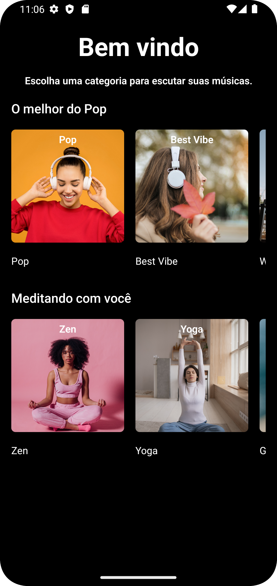
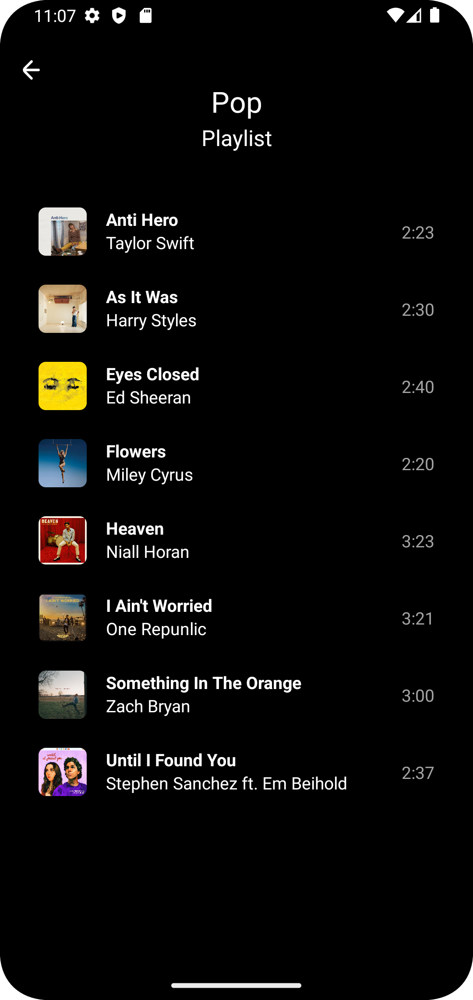
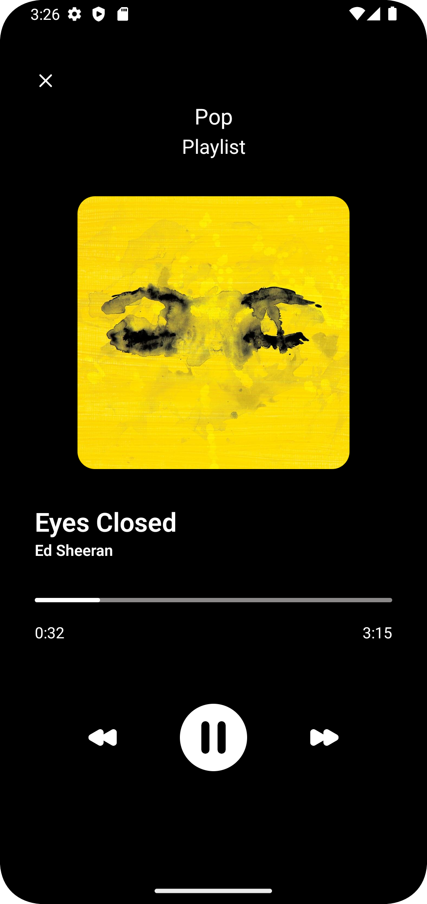
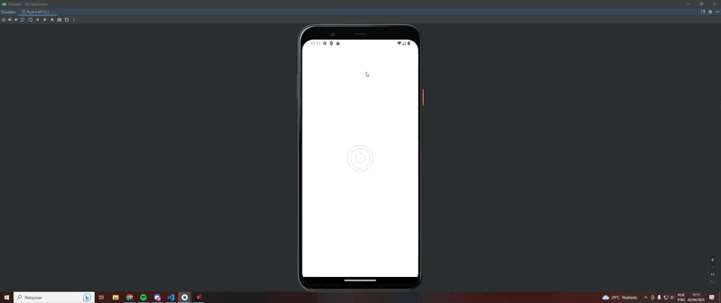

### 👨‍💻 Telas
## 






### ℹ Sobre
##
Projeto de um aplicativo simples de música 👩‍💻
### ⛏ Ferramentas
##

- [React Native](https://reactnative.dev/)

- [React Wind](https://www.nativewind.dev/)

- [Typescript](https://www.typescriptlang.org/)

- [Expo](https://docs.expo.dev/)
 
### 🛳 Navegação
##


### 👩‍💻 Como contribuir
#### 1. Clone o repositório do projeto
```
$ git clone https://github.com/IzaqueNunes/audio-app.git
```
#### 2. Acesse a pasta
```
$ cd audio-app
```
#### 3. Instale as dependencias
```
$ npm install
```
#### 4. Rode o app
```
$ npx expo start
```
